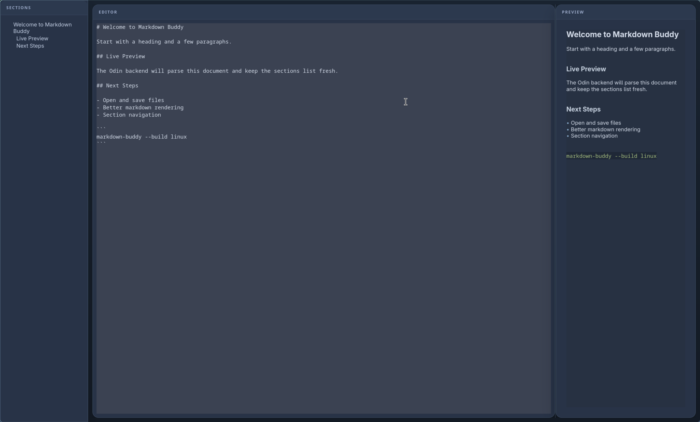

# Markdown buddy

Simple application for writing markdown files with live preview and a section list.

## Structure

Multi language setup:
- Backend: `Odin` -> `C ABI`
- Frontend Linux: `GTK4`
- Frontend Mac: `SwiftUI`
- Frontend Windows: `Win32`
