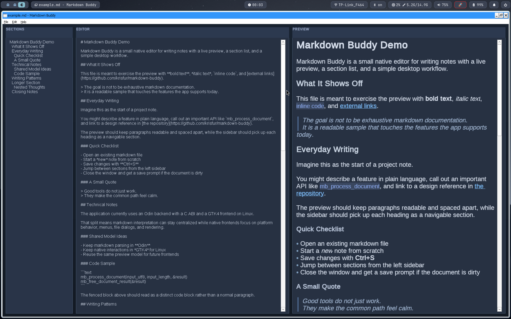

# Markdown buddy

Simple application for writing markdown files with live preview and a section list.

Made for educational purposes of learning how to combine a single backend with platform native frontends via the `C ABI`.

**Linux:**


**MacOS:**


**Windows (wine)**



> Very much a work in progress.

## Structure

Multi language setup:
- Backend: `Odin` -> `C ABI`
- Frontend Linux: `GTK4`
- Frontend Mac: `SwiftUI`
- Frontend Windows: `Win32`

## Build

General requirement: `Odin`, `C/C++` compiler/build tools

Tested tool versions:
- `Odin`: `dev-2026-03:1a5126c6b`
- `GTK4`: `4.20.3`
- `Swift`: `6.2.4`
- `Zig`: `0.15.2`

- Linux: 

    extra requirement: `GTK4 4.20.3`

    ```bash
    bash build-linux.sh
    ./dist/markdown-buddy-gtk4 example.md
    ```

- macOS: 

    extra requirement: `Swift 6.2.4`

    ```bash
    bash build-mac.sh
    ./dist/markdown-buddy-mac example.md
    ```

- Windows (wine): 

    extra requirement: `Zig 0.15.2`

    ```bash
    zig build --build-file build-windows.zig windows --release=fast --prefix dist
    DISPLAY=:0 wine ./dist/markdown-buddy-win.exe example.md
    ```
