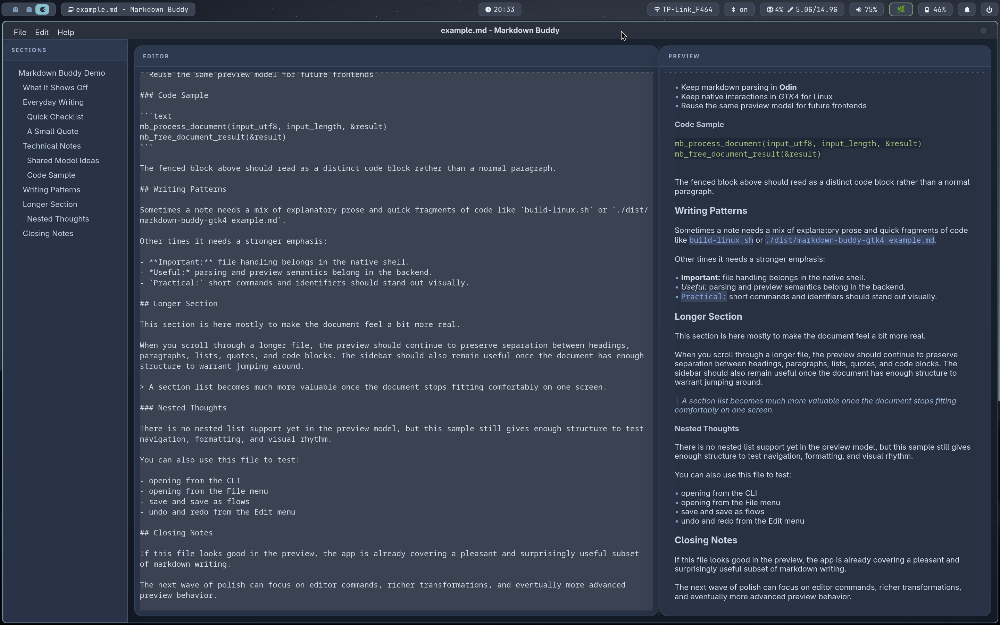
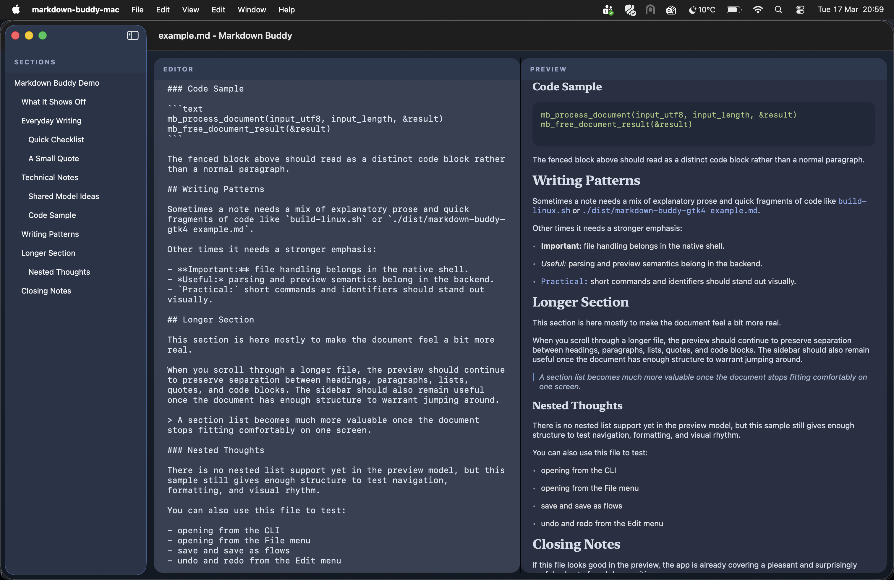

# Markdown buddy

Simple application for writing markdown files with live preview and a section list.

Made for educational purposes of learning how to combine a single backend with platform native frontends via the `C ABI`.

**Linux:**

**MacOS:**

> Very much a work in progress.

## Structure

Multi language setup:
- Backend: `Odin` -> `C ABI`
- Frontend Linux: `GTK4`
- Frontend Mac: `SwiftUI` (to implement)
- Frontend Windows: `Win32` (to implement)
